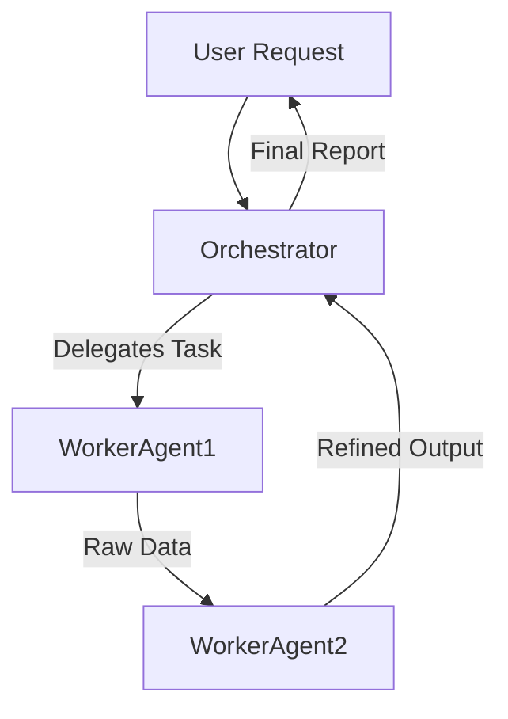

# Strategic Planner Skill

<skill_definition>
The **Strategic Planner** skill is designed to pause the "act-first" loop and force a "think-first" architectural phase. It analyzes a high-level user objective and breaks it down into a granular, observable, and approvable implementation plan. It specifically focuses on identifying the *correct* agents for the job, identifying *missing* capabilities, and mapping the flow of information between these entities.
</skill_definition>

<output_format>
When this skill is invoked (or when the Orchestrator initiates a new task), produce a Markdown report with the following sections:

## 1. 🏗️ Implementation Architecture
*   **Objective:** [Clear restatement of the goal]
*   **Strategy:** [High-level approach, e.g., "Map-Reduce", "Linear Pipeline", "Iterative Refinement"]

## 2. 🤖 Agent & Skill Roster
| Agent Name | Role | Primary Skills Needed | Status |
| :--- | :--- | :--- | :--- |
| `agent-orchestrator` | Manager | `strategic-planner` | ✅ Active |
| `[agent-name]` | [Role] | `[skill-1]`, `[skill-2]` | ⚠️ Proposed / ✅ Active |

*   **New Capabilities Required:**
    *   [If any agents or skills need to be created, list them here with a brief justification.]

## 3. 📋 Task Distribution & Phasing
**Phase 1: [Phase Name]**
*   [ ] **Step 1:** [Action Description] (@AgentName)
*   [ ] **Step 2:** [Action Description] (@AgentName)

**Phase 2: [Phase Name]**
*   [ ] **Step 3:** ...

## 4. 🔄 Data Flow
[Describe how data moves between agents. Use a Mermaid diagram if supported, or ASCII art.]

## 5. 🛑 Approval Request
> **"Do you approve this implementation plan? (type 'yes' or 'proceed' to begin)"**
</output_format>

<usage_instructions>
1.  **Analyze**: Look at the user's request and the current `./agents` and `./skills` directory.
2.  **Draft**: Map out the steps.
3.  **Gap Check**: Do we have the agents? Do we need to create one?
4.  **Visualize**: Draw the data flow.
5.  **Present**: Output the plan in the format above and **WAIT** for user input.
</usage_instructions>
